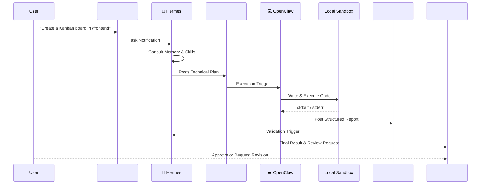

# 🏛️ System Architecture

The Forge 2 Qualifier multi-agent system is built around a clear separation of concerns, utilizing an orchestrator (Hermes) and a coder (OpenClaw). They communicate asynchronously via Slack, enabling human-in-the-loop oversight and clear audit trails.

---

## 🏗️ App Architecture
The Kanban application structure consists of:
**React frontend → Laravel REST API → SQLite**

The backend is included in the `/backend` directory as a Laravel API scaffold, serving as the foundation for the Kanban API.

---

## 🤖 Agents

### 🧠 Hermes (The Brain / Orchestrator)
- **Primary Model**: `owl-alpha`
- **Role**: High-level planning, contextual memory management, orchestration, and task decomposition.
- **Workflow**:
  1. Receives raw user tasks from the `#sprint-main` channel.
  2. Consults its persistent memory (`memory/hermes_memory.json`) and available skills (`skills/`).
  3. Decomposes the task into an actionable plan and posts it to `#agent-orchestrator`.
  4. Validates the output returned by OpenClaw.
  5. Formats the final deliverable and requests human sign-off in `#human-review`.

### 💻 OpenClaw (The Hands / Coding Agent)
- **Primary Model**: `qwen2.5-coder` (via Ollama)
- **Role**: Code generation, local execution, and file operations.
- **Workflow**:
  1. Reads the decomposed plan generated by Hermes in `#agent-orchestrator`.
  2. Autonomously writes the required code and executes it within the local repository sandbox.
  3. Captures execution stdout/stderr and saves generated files to `outputs/`.
  4. Posts a structured status report (`What I Did`, `What's Left`, `What Needs Your Call`) back to `#agent-log`.

---

## 💬 Slack Workflow Channels

Communication happens over specific Slack channels to mimic a professional engineering environment:

| Channel | Purpose |
|---------|---------|
| `#sprint-main` / `#commands` | The entry point. The user posts raw tasks and goals here. |
| `#agent-orchestrator` | Hermes formulates and posts structured plans here, delegating the execution to OpenClaw. |
| `#agent-log` | OpenClaw posts a structured status report here after successfully (or unsuccessfully) executing code. |
| `#human-review` | Hermes validates the execution results and posts the final output here for human review and final approval. |

---

## 🔄 Execution Flow Diagram

---

## 🔀 Model Routing Strategy

Our model routing is designed to optimize for capability while maintaining a fully free/open-source footprint.

* **Hermes (Brain)**: `owl-alpha`
  - *Purpose*: Planning, memory, orchestration, task decomposition.
* **OpenClaw (Hands)**: `qwen2.5-coder` (Ollama)
  - *Purpose*: Code generation, execution, file operations.

**Fallback Models**: 
In the event of rate limits or service degradation, the system seamlessly falls back to:
- OpenRouter Free Models
- Gemini 2.5 Flash
