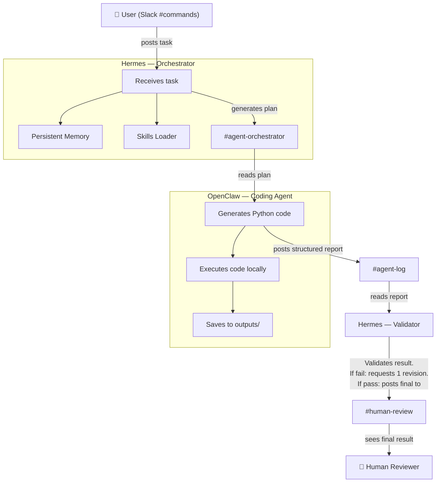

# Forge 2 Edition 1 Qualifier

Hi, I'm Abishek R. I built this repository to participate in the Forge 2 Edition 1 qualifier challenge. This project demonstrates a multi-agent system coordinated through Slack to fulfill both the OpenClaw Mastery and Hermes Mastery requirements (Starter 1 and Starter 2).

I wanted to keep things straightforward and prove that two specialized AI agents could cooperate over Slack to solve tasks. 

## How It Works

I have two agents in this setup:
1. **Hermes** acts as the orchestrator and brain. It receives tasks, formulates a plan, checks its memory and skills, and delegates work.
2. **OpenClaw** is the coding agent. It takes instructions from Hermes, generates Python code, runs it locally, and reports the results back to Slack.

## Architecture

Here is how the components communicate:



## Repository Walkthrough

- `README.md`: Architecture, setup instructions, and evaluation checklist.
- `QUALIFIER_NOTES.md`: My personal notes on building the qualifier, limitations, and manual testing.
- `EVIDENCE.md`: The mapping of handbook requirements to files and screenshots.
- `agent-log.md`: A log of the tasks completed, showing the task loop, revision loop, and autonomous runs.
- `agents/`: The Python scripts for my agents.
- `memory/`: Contains `hermes_memory.json` which proves Hermes has persistent memory.
- `skills/`: The folder containing skills like `hello-world` and `forge-status`.
- `outputs/`: Where OpenClaw saves files after execution (e.g., `results.json`, `autonomous-run.txt`).
- `screenshots/`: Visual evidence of the Slack workflow.
- `run_system.py`: The main script to run the agents.
- `tests/`: Basic validation tests.

## Evaluation Checklist

I've made sure to hit the following requirements for Starter 1 and Starter 2:

- [x] **Task execution**: OpenClaw runs code and saves output.
- [x] **Revision loop**: Documented in `agent-log.md` (Session 2).
- [x] **Status reporting**: Formatted as What I Did / What's Left / What Needs Your Call.
- [x] **Memory**: Hermes uses `memory/hermes_memory.json`.
- [x] **Skill**: Predefined skills exist in `skills/`.
- [x] **Plan before action**: Hermes posts plans to `#agent-orchestrator`.
- [x] **Autonomous run**: Script triggers agent check to generate `autonomous-run.txt`.

## Screenshots Checklist

The `screenshots/` folder contains visual proof for:
- [x] User posting a task in `#commands`
- [x] Hermes posting a plan in `#agent-orchestrator`
- [x] OpenClaw posting a structured status report in `#agent-log`
- [x] Hermes validating and posting final result in `#human-review`
- [x] A successful memory retrieval
- [x] A successful skill trigger

## Setup Instructions

### Prerequisites
1. Python 3.10+
2. A Slack workspace with a Bot Token and App-Level Token.
3. API keys for the LLMs being used (e.g. Groq).
4. Local Ollama if using local models (`ollama pull qwen2.5-coder`).

### Installation
```bash
git clone https://github.com/Abishek2207/forge2-qualifier-abishek.git
cd forge2-qualifier-abishek
python -m venv .venv
# Activate venv
pip install -r requirements.txt
```

### Configuration
Copy `.env.example` to `.env` and fill in your keys. Create the necessary Slack channels (`#commands`, `#agent-orchestrator`, `#agent-log`, `#human-review`).

### Run the Agents
```bash
python run_system.py
```
