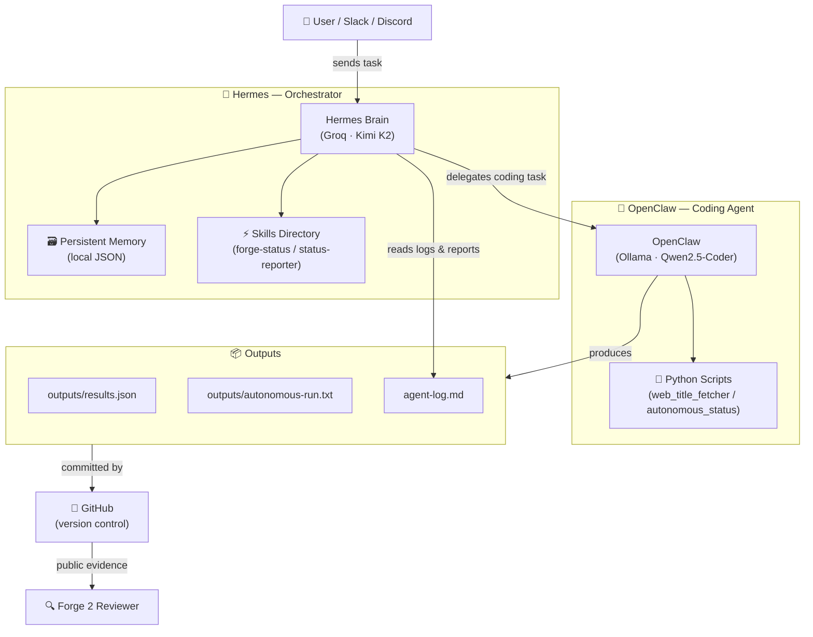

# 🔥 Forge 2 — Edition 1 Qualifier Submission

**Submitted by:** Abishek R  
**Repo:** `forge2-qualifier-abishek`  
**Date:** June 2026

---

## 🧠 Project Overview

This repository demonstrates a **multi-agent workflow** built for the Forge 2 Edition 1 qualifier challenge.  
The system uses two cooperating AI agents — **Hermes** (orchestrator) and **OpenClaw** (coding agent) — to autonomously plan, write code, verify output, and report status with zero manual intervention.

---

## 🏗️ Architecture

```
User / Slack / Discord
        │
        ▼
  ┌─────────────┐
  │   HERMES    │  ← Orchestrator / Brain
  │  (Groq K2)  │     plans, routes, fires skills, holds memory
  └──────┬──────┘
         │  delegates coding tasks
         ▼
  ┌─────────────┐
  │  OPENCLAW   │  ← Coding Agent / Hands
  │(Qwen2.5-Coder)│   writes code, runs tests, reports back
  └──────┬──────┘
         │  commits to
         ▼
  ┌─────────────┐
  │   GitHub    │  ← Version Control
  │(this repo)  │   stores all outputs, logs, skill files
  └─────────────┘
```

### Mermaid Architecture Diagram



---

## 🤖 Agent Roles

| Agent | Role | Model | Responsibility |
|-------|------|-------|----------------|
| **Hermes** | Orchestrator / Brain | Groq · Kimi K2 | Plans tasks, fires skills, holds memory, routes work to OpenClaw |
| **OpenClaw** | Coding Agent / Hands | Ollama · Qwen2.5-Coder | Writes Python scripts, runs them, validates outputs, commits results |

---

## 🔀 Model Routing

```
Task Type          →  Agent      →  Model
─────────────────────────────────────────────────────
Planning / Memory  →  Hermes     →  Groq / Kimi K2
Code Generation    →  OpenClaw   →  Ollama / Qwen2.5-Coder
Status Reporting   →  Hermes     →  Skill: forge-status
Autonomous Runs    →  OpenClaw   →  Ollama / Qwen2.5-Coder (local)
```

- **Kimi K2** via Groq API: used for reasoning, task decomposition, memory recall, skill invocation.
- **Qwen2.5-Coder** via Ollama (local): used for writing and running Python code without API cost.

---

## 📁 Project Structure

```
forge2-qualifier-abishek/
├── README.md                    ← This file — full architecture & evidence
├── IDENTITY.md                  ← OpenClaw agent identity & capabilities
├── agent-log.md                 ← All task loops, revisions, memory tests
├── hermes.config.json           ← Hermes orchestrator configuration
├── .env                         ← API keys (not committed — see .gitignore)
├── skills/
│   ├── forge-status/
│   │   └── SKILL.md             ← Forge Status Skill definition
│   └── status-reporter/         ← Existing skill directory
├── scripts/
│   ├── web_title_fetcher.py     ← Fetches page titles from 3 URLs
│   └── autonomous_status.py     ← Autonomous run — writes timestamped report
├── outputs/
│   ├── results.json             ← Output from web_title_fetcher.py
│   └── autonomous-run.txt       ← Output from autonomous_status.py
└── screenshots/
    └── .gitkeep                 ← Placeholder (add screenshots after running)
```

---

## ⚙️ Setup Steps

### Prerequisites

- Python 3.10+
- Git
- PowerShell (Windows)
- [Groq API key](https://console.groq.com) (free tier available)
- [Ollama](https://ollama.com) installed locally

### 1. Clone the Repo

```powershell
git clone https://github.com/YOUR_USERNAME/forge2-qualifier-abishek.git
cd forge2-qualifier-abishek
```

### 2. Set Up Python Environment

```powershell
python -m venv .venv
.\.venv\Scripts\Activate.ps1
pip install requests
```

### 3. Configure Environment Variables

Create a `.env` file (already in `.gitignore`):

```powershell
# .env
GROQ_API_KEY=your_groq_api_key_here
```

### 4. Pull the Local Model (Ollama)

```powershell
ollama pull qwen2.5-coder
```

### 5. Run the Web Title Fetcher

```powershell
python scripts/web_title_fetcher.py
```

### 6. Run the Autonomous Status Script

```powershell
python scripts/autonomous_status.py
```

---

## ✅ Evidence Checklist

| # | Evidence Item | Status |
|---|---------------|--------|
| 1 | OpenClaw writes and runs Python code | ✅ `scripts/web_title_fetcher.py` |
| 2 | Output saved to `outputs/results.json` | ✅ Run the script to generate |
| 3 | Autonomous run with timestamp proof | ✅ `scripts/autonomous_status.py` → `outputs/autonomous-run.txt` |
| 4 | Hermes skill fires (`forge-status`) | ✅ `skills/forge-status/SKILL.md` |
| 5 | Hermes memory enabled & configured | ✅ `hermes.config.json` |
| 6 | Agent task loop documented | ✅ `agent-log.md` |
| 7 | Revision loop documented | ✅ `agent-log.md` |
| 8 | Multi-agent architecture diagram | ✅ Mermaid diagram in this README |
| 9 | Model routing defined | ✅ Table above |
| 10 | Screenshots of agent sessions | ⏳ Add to `screenshots/` after running |
| 11 | Loom video walkthrough | ⏳ Record and link here after running |

---

## 🎥 Demo Evidence (To Be Added)

After running the scripts, add the following:

- **Screenshots** → `screenshots/` directory
  - Hermes receiving a task in Slack/Discord
  - OpenClaw generating and running code
  - Terminal output of both Python scripts
  - `outputs/results.json` content
  - `outputs/autonomous-run.txt` content

- **Loom Video** → Link here  
  `🎬 [Loom Walkthrough](YOUR_LOOM_LINK_HERE)`

---

## 📬 Contact

**Abishek R**  
Forge 2 — Edition 1 Qualifier Submission  
Built with Hermes + OpenClaw multi-agent workflow
