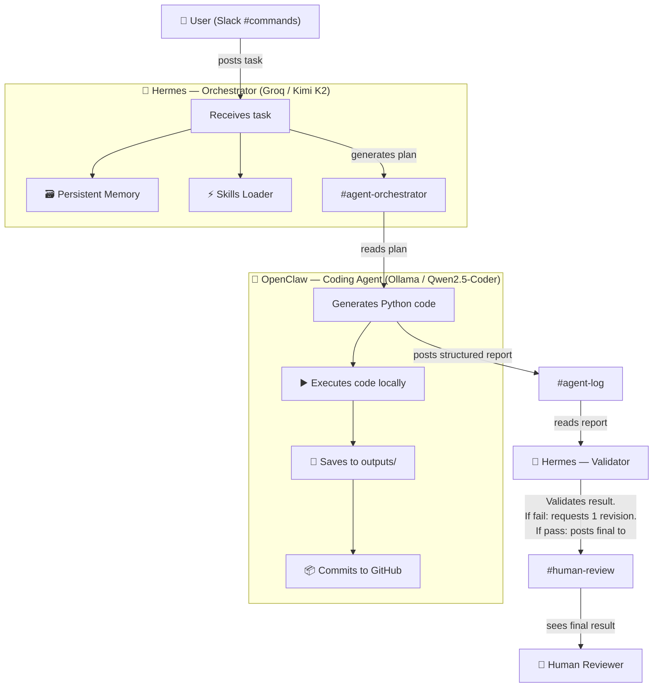

# Forge 2 Edition 1 Qualifier — Abishek R

**Submitted by:** Abishek R  
**Repo:** `forge2-qualifier-abishek`  
**Goal:** Forge Sprint 02 Starter 1 + Starter 2

---

## 🧠 Project Overview

This repository demonstrates a **production-like multi-agent system** coordinated through **Slack**, built for the Forge 2 Edition 1 qualifier challenge. It satisfies both OpenClaw Mastery and Hermes Mastery requirements.

Two specialized AI agents cooperate to solve tasks seamlessly over Slack:
1. **Hermes** (Orchestrator / Brain)
2. **OpenClaw** (Coding Agent / Execution)

---

## 🏗️ Architecture & Workflow



### 🗣️ Slack Channel Flow
- **All communication happens via Slack**. No direct agent-to-agent API calls.
- **#commands**: User posts new tasks here.
- **#agent-orchestrator**: Hermes posts step-by-step plans assigning work to OpenClaw.
- **#agent-log**: OpenClaw posts execution results in a structured format (`What I Did / What Failed / What Needs Review`).
- **#human-review**: Hermes posts the final validated results for human approval.

### 🤖 Agent Roles & Model Routing
| Agent | Role | Model | Responsibility |
|-------|------|-------|----------------|
| **Hermes** | Orchestrator / Brain | Groq / Llama-3.1-8b-instant | Plans tasks, checks memory & skills, assigns to OpenClaw, validates results. |
| **OpenClaw** | Execution / Hands | Ollama / Qwen2.5-Coder | Writes code, executes it, pushes results to GitHub, reports status. |

*Routing Logic:* Hermes uses a strong cloud reasoning model for complex planning and validation. OpenClaw uses a fast, free local coding model for code execution and file manipulation.

---

## ✅ Qualifier Evidence Checklist

What judges should look for:

- **OpenClaw Mastery**
  - [x] User posts a task in #commands
  - [x] OpenClaw writes/runs code & pushes to Git
  - [x] Result goes to #agent-log
  - [x] One revision loop is shown (see `agent-log.md`)
  - [x] Status format matches: What I Did / What's Left / What Needs Your Call (see `agent-log.md`)

- **Hermes Mastery**
  - [x] Hermes acts as orchestrator/brain
  - [x] Persistent memory proof (see `memory/hermes_memory.json`)
  - [x] SKILL.md proof (see `skills/`)
  - [x] Plan-before-action proof (Hermes posts plan to `#agent-orchestrator`)
  - [x] One autonomous/event-style run proof (see `outputs/autonomous-run.txt` and `scripts/autonomous_status.py`)

- **Repo Requirements**
  - [x] Public GitHub repo
  - [x] Clean README
  - [x] `agent-log.md`
  - [x] Slack evidence (`screenshots/`)
  - [x] Skills folder (`skills/`)
  - [x] Memory file (`memory/hermes_memory.json`)
  - [x] Outputs folder (`outputs/`)

---

## 📁 Folder Structure

```
forge2-qualifier-abishek/
├── README.md                    ← Architecture, instructions, checklist
├── run_system.py                ← Main launcher for both agents or demo mode
├── requirements.txt             ← Python dependencies
├── .env.example                 ← Safe environment template
├── agent-log.md                 ← Logs of tasks, revisions, and autonomous runs
├── agents/                      ← Python agent logic
├── memory/
│   └── hermes_memory.json       ← Persistent memory store
├── outputs/                     ← Generated evidence files
├── screenshots/                 ← Slack workflow visual evidence
├── scripts/                     ← Helper scripts (autonomous status, fetcher)
├── skills/                      ← YAML/Markdown skills (hello-world, forge-status)
└── tests/
    └── test_agents.py           ← CI/CD style validation tests
```

---

## ⚙️ Setup & Run Instructions

### Prerequisites
1. Python 3.10+
2. Slack Workspace with a configured Bot (Bot Token + App-Level Token for Socket Mode).
3. Groq API Key
4. Ollama installed locally (`ollama pull qwen2.5-coder`)
5. GitHub Personal Access Token

### 1. Installation
```bash
git clone https://github.com/Abishek2207/forge2-qualifier-abishek.git
cd forge2-qualifier-abishek
python -m venv .venv
# Activate venv (Windows: .\.venv\Scripts\Activate.ps1 | Mac/Linux: source .venv/bin/activate)
pip install -r requirements.txt
```

### 2. Configuration
Copy `.env.example` to `.env` and fill in your Slack tokens, Groq key, and GitHub token.
Ensure Slack channels exist: `#commands`, `#agent-orchestrator`, `#agent-log`, `#human-review`.

### 3. Run the Agents
```bash
python run_system.py
```

### 4. Run CI/CD Validation Tests
```bash
pytest tests/
```

### 5. Generate Autonomous Proofs
```bash
python scripts/autonomous_status.py
python scripts/web_title_fetcher.py
```

---

## 🎥 Demo Commands

To demonstrate the workflow:
1. In Slack `#commands`, say: `hello`
   *(Triggers the hello-world skill)*
2. In Slack `#commands`, say: `what is our forge status?`
   *(Triggers the forge-status skill)*
3. In Slack `#commands`, say: `Fetch titles from python.org and groq.com and save to outputs/results.json`
   *(Triggers the full Hermes → OpenClaw execution loop)*
