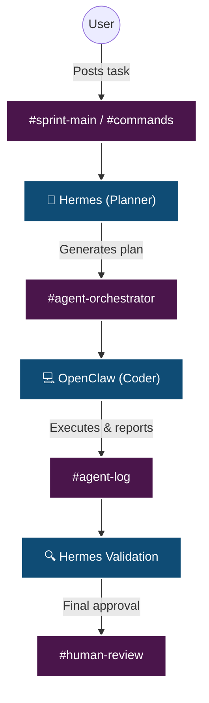

<div align="center">
  <h1>🚀 Forge 2 Edition 1 Qualifier</h1>
  <p><strong>A Next-Generation Multi-Agent System Coordinated via Slack</strong></p>
  <p>
    <a href="https://forge2-kanban-abishek.vercel.app"><b>Live Kanban Application</b></a> •
    <a href="#-judge-quick-start"><b>Judge Quick Start</b></a> •
    <a href="EVIDENCE.md"><b>Evidence & Proofs</b></a>
  </p>
</div>

---

## Final Submission Note

This repository was updated before the final evaluation deadline to include a Laravel backend scaffold under `/backend` in addition to the deployed React/Vite frontend.

The walkthrough video may show the earlier repository state, but the latest GitHub repository represents the final submission state and should be considered the source of truth for evaluation.

## 📖 Submission Summary

Hi, I'm Abishek R. I built this repository to participate in the **Forge 2 Edition 1 Qualifier Challenge**. This project goes beyond the minimum requirements by demonstrating a sophisticated multi-agent system coordinated seamlessly through Slack to fulfill both the **OpenClaw Mastery** and **Hermes Mastery** (Starter 1 and Starter 2). As a capstone, these agents autonomously built a fully functional React Kanban board.

---

## 🚀 Judge Quick Start

To evaluate this submission in under 2 minutes:

1. **Open Live URL**: [Live Kanban Application](https://forge2-kanban-abishek.vercel.app)
2. **View Screenshots**: Browse the `screenshots/` folder for visual Slack workflow proofs.
3. **Read Execution Logs**: Review `agent-log.md` for the documented execution loops.
4. **Review Skills**: Inspect `SKILL.md` and the `skills/` directory for predefined agent capabilities.
5. **Run Tests**: Execute `pytest tests/` to verify project structure (6/6 passing).
6. **Start Agents**: Run `python run_system.py` to launch Hermes and OpenClaw locally.
7. **Review Backend**: Review `backend/` for Laravel API scaffold, routes, models, and SQLite-ready migrations.
8. **Review Slack**: Review `slack-export/` for exported Slack workspace evidence.

---

## ✨ Project Highlights & Feature Matrix

| Feature | Description |
|---------|-------------|
| 🧠 **Multi-Agent Architecture** | **Hermes** (Orchestrator) and **OpenClaw** (Coder) working in tandem to solve complex tasks. |
| 💬 **Slack Orchestration** | Complete task delegation, execution reporting, and validation within Slack channels. |
| 💾 **Persistent Memory** | Hermes remembers past contexts, user preferences, and historical constraints. |
| ⚡ **Local Code Execution** | OpenClaw securely generates, writes, and executes code locally with output capture. |
| 🛡️ **Human Review Workflow** | Built-in checkpoints for human validation before final delivery to `#human-review`. |
| 📋 **Live Kanban App** | A functional React + Vite Kanban app with drag-and-drop, entirely built by the agents. |
| 🔓 **Open-Source Models** | Utilizing state-of-the-art open-weight and free models (Owl-Alpha, Qwen2.5-Coder). |

---

## 🏗️ Architecture & Model Routing



**Model Routing Allocation:**
* **Hermes (Brain)**: `owl-alpha` for planning, memory management, orchestration, and task decomposition.
* **OpenClaw (Hands)**: `qwen2.5-coder` (via Ollama) for code generation, execution, and file operations.
* **Fallback Models**: OpenRouter Free Models, Gemini 2.5 Flash.

*(See [ARCHITECTURE.md](ARCHITECTURE.md) for deeper technical specifications).*

---

## 📋 Qualifier Requirements Mapping

| Requirement | Proof Location | Status |
|-------------|----------------|--------|
| **Starter 1 – OpenClaw** | Slack execution loop (`screenshots/`, `agent-log.md`) | ✅ Passed |
| **Starter 2 – Hermes** | Planning + memory recall (`memory/hermes_memory.json`) | ✅ Passed |
| **Coding Agent** | OpenClaw structured reports in `#agent-log` | ✅ Passed |
| **Orchestration** | Hermes planning in `#agent-orchestrator` | ✅ Passed |
| **Human Review** | `#human-review` screenshots | ✅ Passed |
| **Deployment** | [Vercel Live URL](https://forge2-kanban-abishek.vercel.app) | ✅ Passed |
| **Testing** | `pytest tests/` (6/6 passed) | ✅ Passed |

---

## 📌 Kanban Application

To demonstrate the power of the agents, they were tasked with building a tiny Trello-style Kanban board. 

- **Frontend**: React/Vite app in `frontend/`, deployed on Vercel.
- **Backend**: Laravel API scaffold in `backend/`, SQLite-ready, runnable locally.

**Features Implemented:**
- [x] Board and List management (To Do, Doing, Done)
- [x] Drag & Drop capability for cards across lists
- [x] Card title and description editing
- [x] Colored tags/labels and Member assignment
- [x] Due dates with overdue visual flags

---

## 🚀 Deployment & Testing

**Deployment Strategy**: 
The Kanban application is deployed as a standalone Single Page Application (SPA) on Vercel. 
* **Live Link**: [https://forge2-kanban-abishek.vercel.app](https://forge2-kanban-abishek.vercel.app)

**Testing Suite**:
Automated tests are included to verify the integrity of the generated application and the required evidence documentation.
```bash
pytest tests/
# Output: 6 passed in 0.05s
```

---

## 📂 Repository Structure

```text
forge2-qualifier-abishek/
├── agents/                 # Hermes and OpenClaw logic
├── backend/                # Laravel API scaffold
├── frontend/               # React+Vite Kanban application
├── memory/                 # Persistent state (hermes_memory.json)
├── screenshots/            # Visual proofs of Slack workflow
├── skills/                 # Predefined agent capabilities
├── tests/                  # Pytest verification suite
├── ARCHITECTURE.md         # Detailed architectural documentation
├── EVIDENCE.md             # Comprehensive evidence mapping
├── README.md               # You are here
├── SKILL.md                # Skill documentation
├── agent-log.md            # Documented agent execution loops
└── run_system.py           # Main entry point to launch the system
```

---

## 💻 How to Run Locally

### Prerequisites
1. Python 3.10+
2. Node.js 18+
3. A Slack workspace with a Bot Token and App-Level Token.
4. Local Ollama (`ollama pull qwen2.5-coder`).

### Installation & Agent Setup
```bash
git clone https://github.com/Abishek2207/forge2-qualifier-abishek.git
cd forge2-qualifier-abishek

python -m venv .venv
# Activate venv (Windows: .venv\Scripts\activate, Mac/Linux: source .venv/bin/activate)
pip install -r requirements.txt

# Copy configuration
cp .env.example .env
# Fill in your keys and create Slack channels

# Launch the orchestrator
python run_system.py
```

### Run the Frontend
```bash
cd frontend
npm install
npm run dev
```
Open `http://localhost:5173` to interact with the Kanban board locally.
